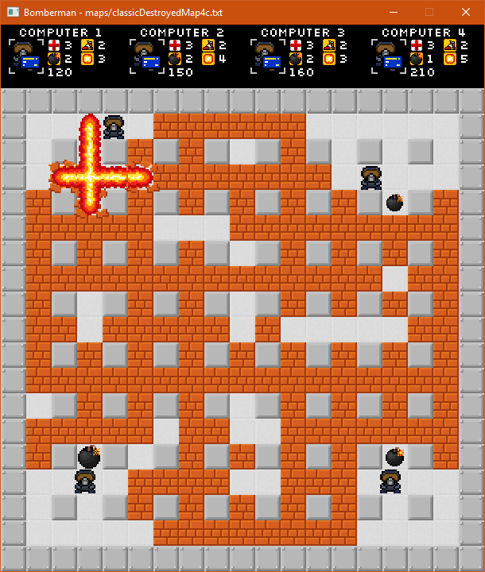
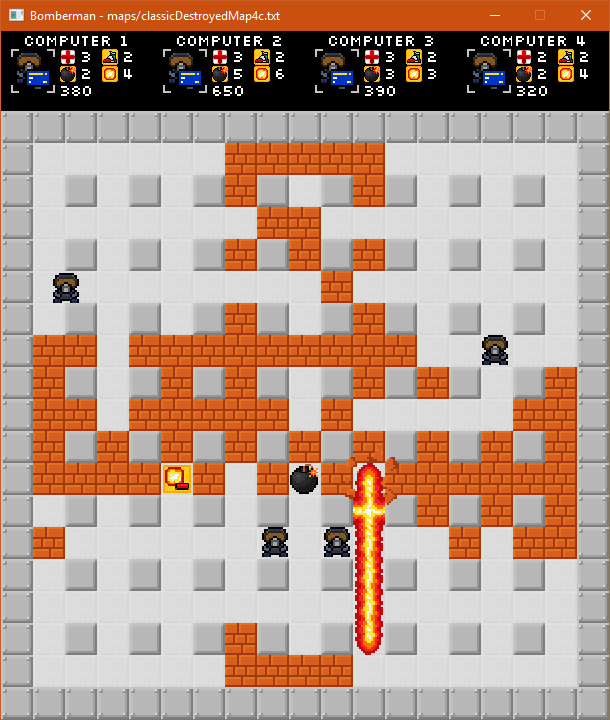
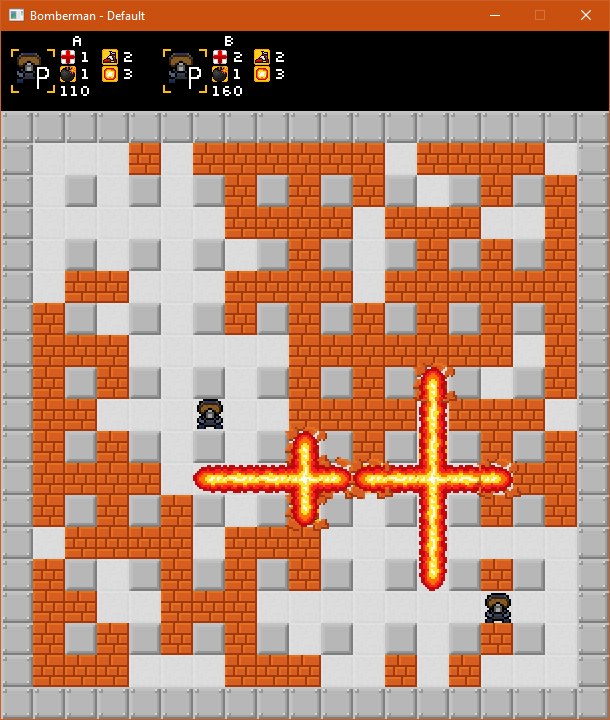
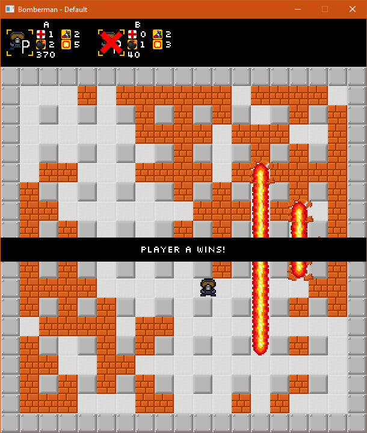

# Bomberman game
## A clone game written in C++ and SDL2
[](https://opensource.org/licenses/MIT)

The game is a basic implementation of a bomberman arena where players or computers play against each other. The goal of the game is to eliminate other players or computers. The game has a detailed czech description in the `zadani.txt` file. The code and docs are all in english.

*Originally written as semestral work for the BI-PA2 class at Czech Technical University in Prague.*

# Building on Linux
On linux you can build the game using the provided Makefile.
You need to have SDL2 libraries installed, specifically:
- SDL2 (the core library)
- SDL2_image
- SDL2_ttf

Then you can build the binary using
```
make
make compile
```

Other make commands are available
```bash
make run 	#runs the game
make doc 	#generates the docs in the doc directory
make clean	#removes all generated files
```

# Building on Windows
There is no build system for windows aside from just using the source code and compiling everything manually.

A precompiled game `Bomberman.exe` binary is however ready to run in the `windowsBuild` directory together with the required libraries and resources.

# Starting the game
The game doesn't have proper gui menus and its map and settings are set using a config file.
It can be started in the default mode for 2 players just by starting the binary.
Other maps can be set by passing a config file path as an argument to the binary.

Linux:
```
./bomberman config.cfg
```
Windows:
```
Bomberman.exe config.cfg
```

# Game controls
Players:
<dl>
  <dt>Player A</dt>
  <dd>WSAD and Space to place a bomb</dd>
  <dt>Player B</dt>
  <dd>Arrows and Enter to place a bomb</dd>
</dl>

Other controls:
<dl>
  <dt>ESC</dt>
  <dd>Exit game</dd>
  <dt>F1</dt>
  <dd>Enables bounding boxes</dd>
  <dt>F2</dt>
  <dd>Shows AI pathfinding paths and tiles the AI considers dangerous</dd>
  <dt>F3</dt>
  <dd>Enables debug logging in the console</dd>
  <dt>F4</dt>
  <dd>Slow motion</dd>
</dl>






